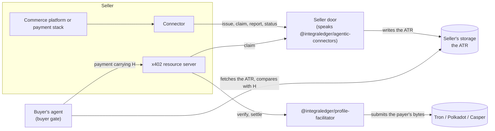

# integra-agentic-connectors

The seller side of proof of agreement: the contract a seller's systems speak to put an Agentic Transaction Record's
hash into their payments, and an x402 facilitator for the LCP profiles on Tron, Polkadot and Casper.

Before a buyer's agent pays, the seller's side assembles an **Agentic Transaction Record (ATR)**: the agreement's
record, a JSON document the seller serves. The **ATR hash (H)** is SHA-256 over the ATR's exact bytes. H rides inside
the payment, in the field the payment protocol provides, so paying is agreeing to that exact record. That is the
pattern of the **Legal Context Protocol (LCP)**. The buyer's side runs the **buyer gate**, which compares the served
bytes with H before anything is signed.

## How the packages fit together



- **The contract** fixes what a connector and the seller door say to each other: issue the ATR before approval, claim
  a presented payment before it moves, report the platform's payment reference after, and read the record and what it
  proves.
- **The profile facilitator** verifies and settles x402 payments on the three LCP profiles that carry H in the payer's
  own signed transaction on Tron, Polkadot and Casper.
- Both use [`@integraledger/lcp`](https://github.com/IntegraLedger/integra-protocol), which owns the ATR's assembly
  and hashing and every binding of H into a payment.

## Packages

| Package | Purpose | Install |
|---|---|---|
| [`@integraledger/agentic-connectors`](./contract) | The seller door's contract: `openapi.json`, its TypeScript types, the refusal table and the vectors. | `npm install @integraledger/agentic-connectors` |
| [`@integraledger/profile-facilitator`](./profile-facilitator) | An x402 facilitator for `x402/exact/tron/lcp-trc20-memo`, `x402/exact/polkadot/lcp-assets-remark` and `x402/exact/casper/lcp-runtime-arg`. | `npm install @integraledger/profile-facilitator` |

Both need Node.js `>=26.10.0` and are ESM only. The facilitator also needs Postgres.

## Documentation

The documentation is in [`docs/`](./docs/index.md), and is published at
[connectors.integraledger.com](https://connectors.integraledger.com): concepts, getting started, a guide for each flow
and rail, and the complete reference.

## Quickstart

- **You connect a checkout to the seller door:** start with [Getting started](./docs/getting-started.md), or the
  [contract's README](./contract#readme). Both issue an ATR and read the carriers to place.
- **You accept x402 payments on Tron, Polkadot or Casper:** start with the
  [profile facilitator's README](./profile-facilitator#readme). Its quickstart starts the facilitator and reads
  `/supported`.
- **You implement the seller door, or a test double of it:** replay the contract's vectors. `scripts/stand-in-door.mjs`
  is a local door that answers from them; every sample in these READMEs runs against it.

## Build and test

This repository is a pnpm workspace. The commands are the ones CI runs:

```sh
pnpm install --frozen-lockfile
pnpm -r --if-present run build
pnpm -r --if-present run typecheck
INTEGRA_DATABASE_URL=postgres://postgres@127.0.0.1:5432/postgres pnpm -r --if-present run test
```

The facilitator's tests need `INTEGRA_DATABASE_URL` set to a Postgres database (CI uses Postgres 18); each test file
creates and drops its own database. To start one locally:

```sh
docker run -d --name connectors-pg -e POSTGRES_HOST_AUTH_METHOD=trust -p 127.0.0.1:5432:5432 postgres:18
```

The documentation is checked the same way, after the build:

```sh
node scripts/docs.mjs --check
DATABASE_URL=postgres://postgres@127.0.0.1:5432/postgres node scripts/samples.mjs
```

- `scripts/docs.mjs --check` confirms that the generated reference pages in `docs/reference/` match their sources:
  `contract/openapi.json`, `contract/vectors/` and `@integraledger/lcp`'s pairing registry. Without `--check` it
  writes them.
- `scripts/samples.mjs` type-checks and runs every TypeScript sample in the READMEs and `docs/` against the packages
  built in this tree, compares each printed output with the one shown, and gives each sample a fresh
  `scripts/stand-in-door.mjs` for the door.

The documentation site is built from `docs/` by the app in `website/`, which has its own lockfile; see
[website/README.md](./website/README.md).

## Contributing

Contributions are welcome. Read [CONTRIBUTING.md](./CONTRIBUTING.md) first. Every commit carries a
[Developer Certificate of Origin](https://developercertificate.org) sign-off: commit with `git commit -s`, which adds
`Signed-off-by: Your Name <you@example.com>`. CI checks every pushed commit for it.

By participating you agree to the [Code of Conduct](./CODE_OF_CONDUCT.md).

## Security

Report a bug in a public issue. Report a vulnerability privately, through GitHub's private vulnerability reporting on
this repository (the **Security** tab, then **Report a vulnerability**); see [SECURITY.md](./SECURITY.md).

## License

[Apache-2.0](./LICENSE).
