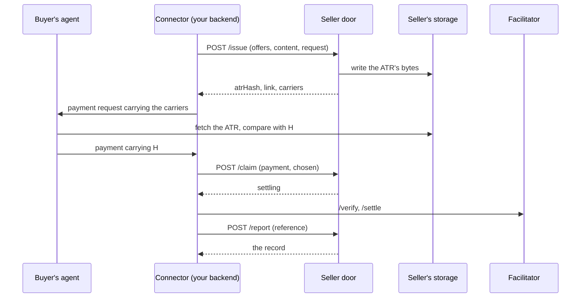

# @integraledger/agentic-connectors

The seller door's contract: the OpenAPI 3.1 document, TypeScript types, refusal table and vectors that a connector
speaks to issue an ATR, claim a presented payment, report a settlement and read a record's status.

**Documentation:** [connectors.integraledger.com](https://connectors.integraledger.com)

## What it is

A **connector** is the software between a commerce platform (or a seller's own payment stack) and the **seller
door**. The door is a server-to-server HTTP API with four operations:

| Operation | Call | When |
|---|---|---|
| `issue` | `POST /issue` | Before the buyer approves: assemble the ATR, write it to the seller's storage, hash it, and return the values to place in the payment request. |
| `claim` | `POST /claim` | When the buyer presents a payment, before your facilitator's `/verify`: the one check that the payment carries this ATR's hash. |
| `report` | `POST /report` | After payment: the platform's payment reference, keyed by the ATR hash. |
| `status` | `GET /status/{atrHash}` | Any time: the record and what it proves. |

This package ships the contract itself, so every party builds against the same bytes:

- `openapi.json`: the OpenAPI 3.1.1 document. It is also served, without a credential, at `GET /openapi.json`.
- `vectors/`: request and answer pairs that any implementation of the door, and any connector's test double, must
  reproduce.
- TypeScript types for every request and answer, the closed refusal table, the document's bytes and the parsed
  vectors.

It contains no client and no server. It is the contract both sides build to.

## Key concepts

- **Agentic Transaction Record (ATR):** the agreement's record, a JSON document the seller serves. The door writes it
  to the seller's storage before it answers `issue`, so a storage failure means no challenge goes out.
- **ATR hash (H):** SHA-256 over the ATR's exact bytes, written `0x` and 64 lowercase hex digits.
- **Legal Context Protocol (LCP):** the pattern this contract serves: the payment carries H, so paying is agreeing to
  that exact record.
- **Pairing:** a payment protocol, scheme and rail combination, such as `x402/exact/eip155/eip3009`. Every offer,
  claim and report names one. The pairing ids are the ones `@integraledger/lcp` registers.
- **Binding:** how H rides in a pairing's payment, the field its specification defines.
- **Carriers:** the forms of H and the ATR's link that `issue` returns for you to place: `lcp:sha256:0x…`,
  `{type, value, legalContextUrl}` and `{type, value, legal_context_url}`.
- **Mint request id:** `mintRequestId` names one state of one checkout. The same id with the same input returns the
  same ATR, byte for byte.
- **Record:** the door's state for one ATR: `issued`, `settling`, `paid`, `closed` or `stale`, with `proves`, the
  statement of what it shows. `stale` is terminal: the payment was claimed, and 604 800 seconds after its `settleBy`
  no read has shown it settled or unable to settle; the record carries a notice and is never paid after that.
- **Seller:** the party serving the resource. **Facilitator:** the x402 role that verifies and settles.
- **Vectors:** the shared test cases that fix the contract byte for byte.



## Install

```sh
npm install @integraledger/agentic-connectors
```

It needs Node.js `>=26.10.0`, and it is ESM only. Its one dependency is `@integraledger/lcp`, whose `AtrHash`,
`Json` and `LcpPattern` types it uses.

## Quickstart

Issue an ATR for an x402 resource, then read the answer. The request is the one in vector `CV1`. Set
`SELLER_DOOR_URL` to your door's base URL and `SELLER_CREDENTIAL` to the tenant's seller credential. This package's
repository runs every sample against a local stand-in door that answers from the vectors (`scripts/stand-in-door.mjs`).

```ts title="issue.ts"
import type { IssueRequest, IssueResponse, Refusal } from "@integraledger/agentic-connectors";

const door = process.env.SELLER_DOOR_URL ?? "https://seller.example/door";
const credential = process.env.SELLER_CREDENTIAL ?? "";

const request: IssueRequest = {
  mintRequestId: "chk_7Q2:v1",
  resource: "quote",
  lifetimeSeconds: 60,
  offers: [
    {
      pairing: "x402/exact/eip155/eip3009",
      option: {
        scheme: "exact",
        network: "eip155:84532",
        amount: "10000",
        asset: "0x036CbD53842c5426634e7929541eC2318f3dCF7e",
        payTo: "0x209693Bc6afc0C5328bA36FaF03C514EF312287C",
        maxTimeoutSeconds: 60,
        extra: { name: "USDC", version: "2" },
      },
    },
  ],
  request: {
    method: "GET",
    path: "/v1/report",
    query: "",
    bodyDigest: "0xe3b0c44298fc1c149afbf4c8996fb92427ae41e4649b934ca495991b7852b855",
  },
  content: [{ slot: "terms", bytes: "IlBheSAxMDAwMCBiYXNlIHVuaXRzIG9mIFVTREMgZm9yIG9uZSByZXBvcnQuIg==" }],
};

const res = await fetch(`${door}/issue`, {
  method: "POST",
  headers: { authorization: `Bearer ${credential}`, "content-type": "application/json" },
  body: JSON.stringify(request),
});
if (!res.ok) {
  const refusal = (await res.json()) as Refusal;
  throw new Error(`${res.status} ${refusal.code}: ${refusal.sentence}`);
}
const issued = (await res.json()) as IssueResponse;
console.log(issued.atrHash);
console.log(issued.link);
console.log(issued.carriers.lcp);
console.log(issued.pairings[0]?.pattern.pattern);
```

```text output
0x3c2394624c8c9a61ebaf7d8750a6f9ac21bf73e6369b7c0b64c83e34509cc3d3
https://atr.seller.example/0x3c2394624c8c9a61ebaf7d8750a6f9ac21bf73e6369b7c0b64c83e34509cc3d3
lcp:sha256:0x3c2394624c8c9a61ebaf7d8750a6f9ac21bf73e6369b7c0b64c83e34509cc3d3
native-field
```

Place `carriers` and `link` where the buyer's agent approves the payment, through the LCP package's entry point for
the protocol. For x402 that is the published profile `x402-exact-eip155-eip3009`.

## The flows

### Issue

Call `issue` before the buyer approves, once per checkout state.

- `mintRequestId` is `<checkout id>:<version>`, matching `^[A-Za-z0-9._:-]{1,128}$`. A retry of the same state reuses
  it and gets the same answer. Any change to the offers, content or request is a new id; reusing an id for other
  input answers `409 issue/mint-request-reused`. If the platform's id has other characters, use the SHA-256 hex of
  it. On `409 issue/mint-request-lapsed`, append `:<n>` with a new `n`.
- `offers` holds 1 to 16 options, each exactly as the challenge will carry it, all of one protocol.
- `content` holds 0 to 56 slots. Each slot is one JSON value, sent as padded base64 of its exact bytes. The door
  writes the bytes into the ATR as received.
- `request` is required on an x402 surface: `{method, path, query, bodyDigest}`, the method token, the
  request-target up to its first `?`, what follows it (or `""`), and SHA-256 over the body bytes as received.
- `lifetimeSeconds` is the challenge's lifetime, 1 to 604 800. On x402, use the largest `maxTimeoutSeconds`.

The answer's `agreement`, when present, means the record needs the agreement step; see
[Card checkouts and the agreement step](#card-checkouts-and-the-agreement-step).

### Claim

Where the pairing reads H from the payment, call `claim` with the presented payment before your facilitator's
`/verify`, so every refusal comes before money moves. Send `payment` exactly as received, `chosen` as the option it
names, `pairing` as the record offered it, and, on x402, the same `request`.

```ts title="claim.ts"
import type { ClaimDeclined, ClaimRequest, ClaimResponse, Refusal } from "@integraledger/agentic-connectors";
import { VECTORS } from "@integraledger/agentic-connectors";

const door = process.env.SELLER_DOOR_URL ?? "https://seller.example/door";
const credential = process.env.SELLER_CREDENTIAL ?? "";

async function call<T>(path: string, body: unknown): Promise<{ status: number; body: T | Refusal }> {
  const res = await fetch(`${door}${path}`, {
    method: "POST",
    headers: { authorization: `Bearer ${credential}`, "content-type": "application/json" },
    body: JSON.stringify(body),
  });
  return { status: res.status, body: (await res.json()) as T | Refusal };
}

// CV6: the issue, then the payment the buyer presents, claimed twice.
const [issue, claim] = VECTORS["CV6"]!.steps;
await call("/issue", issue!.request.body);
const presented = claim!.request.body as unknown as ClaimRequest;

const first = await call<ClaimResponse | ClaimDeclined>("/claim", presented);
if (first.status === 200 && "state" in first.body) {
  console.log(first.body.state, "claimed:", "proves" in first.body && first.body.proves.claimed);
}
const again = await call<ClaimResponse>("/claim", presented);
console.log(again.status, "code" in again.body ? again.body.code : "");
```

```text output
settling claimed: true
409 claim/in-progress
```

A `409 claim/in-progress` on a retry of the same presentation means the first attempt won. A pairing whose payment
carries nothing the buyer signs answers `422 claim/nothing-to-check`: report it instead.

A **pushed** payment is one the buyer broadcast before the claim. If its check fails, the money has already moved, so
the door answers `200` with `state: "declined"`, the check's `code`, the hash the payment is bound to (or `null`) and
the landed `transaction`. Tell the buyer the payment was not accepted for this record, with that code. It is not a
refusal to pay.

### Report

After payment, call `report` with the platform's payment reference as it comes, and retry until a 2xx or a 4xx.

- `200`: the record as it now stands.
- `202` with `state: "settling"`: final for you; the door finishes the record.
- `202` with `state: "issued"`: nothing was read yet; report again later.

The door reads a reported payment on the rail before it records it. A report of money that moved is recorded even
without a claim, and the record then states what is missing. On a record with no claim, send `chosen` (and, on
x402, `request`), from which the door takes the payment's read keys. A report naming another pairing than the
record's answers `409 report/pairing-mismatch`.

### Status

`GET /status/{atrHash}` returns the record: its `state`, `expiresAt`, `settlement`, `proves`, and the `agreement` and
`channel` legs where they apply. Keep no payment state of your own; the record is the state.

```ts title="status.ts"
import type { RecordView } from "@integraledger/agentic-connectors";

const door = process.env.SELLER_DOOR_URL ?? "https://seller.example/door";
const credential = process.env.SELLER_CREDENTIAL ?? "";
const atrHash = "0xcfa3a6589bf1e273ab105bb7144a2d5944af1caed14f58b39145d46842f825d8";

const res = await fetch(`${door}/status/${atrHash}`, { headers: { authorization: `Bearer ${credential}` } });
const record = (await res.json()) as RecordView;
console.log(record.state, record.proves.settledBy, record.agreement?.state);
console.log(record.proves.pattern?.proves.split(". ")[0]);
```

```text output
paid seller-report recorded
Before this payment, the buyer signed and paid an agreement transaction carrying this ATR's hash on eip155:84532, recorded in 0x2222222222222222222222222222222222222222222222222222222222222222
```

Show the buyer and the seller `proves` as the door returns it. Never claim that the buyer signed the hash where
`claimed` is false. `settledBy` says what made the payment paid: `read` (a read of the rail), `facilitator` (the
facilitator's settle answer) or `seller-report` (on a pairing with nothing to read).

### Card checkouts and the agreement step

Where a pairing's payment carries no public proof of H, a seller can require the **agreement step**. `issue` then
answers with `agreement: {url, network, pairing}`. Before the full payment, the buyer's agent pays a nominal amount at
`agreement.url`, on `agreement.network`, in a payment whose signed payload carries H.

- Place `agreement.url` beside the carriers: on MPP as `opaque.legalContextAgreementUrl`; elsewhere as
  `legalContextAgreementUrl` beside `legalContextUrl`, or in the protocol's own place beside the link.
- Never start or accept the full payment before `status` shows `agreement.state` `recorded`. Until then `claim`
  answers `409 claim/agreement-first`. An agreement leg whose claimed payment shows neither settlement nor failure
  604 800 seconds after its `settleBy` becomes `stale`, which is terminal: that agreement is never recorded.
- A payment reported before the agreement is recorded is still recorded, and its record says that no agreement was
  recorded before it and that nothing public carries this ATR's hash (vector `CV10`).

A plain card checkout uses the pairing `card/seller-reference`: `issue` takes a card option `{scheme, checkout}` and
the checkout as shown, in `content`; `claim` answers `422 claim/nothing-to-check`; and `report` takes the
processor's reference with `network: "card"`, once the agreement is recorded (vector `CV9`).

### Channels, sessions and subscriptions

For a channel pairing, claim the opening only. The opening carries H, and one ATR covers the whole channel, session
or subscription. Serve later requests yourself and never claim them (a claim answers `409 claim/channel-open`), and
repeat the channel's legal context in every later 402. Report the close as
`{atrHash, pairing, state: "closed", reference}`, where `reference` is the close transaction; the door reads it with
the keys recorded at the opening. For a subscription whose payment carries nothing to claim, the opening's `report`
with `outcome: "paid"` records the channel, with the subscription's own identifier as `reference`.

### What each path sends

| Path | Pairing | `issue` | `claim` | `report` |
|---|---|---|---|---|
| x402 beside a seller's stack | `x402/exact/eip155/eip3009` | each `PaymentRequirements` as the 402 will carry it; `request`; `lifetimeSeconds` = the largest `maxTimeoutSeconds` | `payment` = the `PaymentPayload`; `chosen` = its `accepted`; `network` = `accepted.network`; `settleBy` = `validBefore` | `reference` = the facilitator's `transaction`; `chosen` = `accepted` |
| other protocols | the pairing's LCP entry point | as that entry point's profile says | as that profile says, where the buyer signs | the rail's reference |
| plain card checkout | `card/seller-reference` | a card option `{scheme, checkout}`; the checkout as shown, in `content`; its lifetime | not applicable (`claim/nothing-to-check`) | the processor's reference, once the agreement is recorded; `network` = `card` |

## The connector rules

Every connector follows these rules. Each carries its reason.

1. **Server to server.** Only the connector's backend calls the door, over HTTPS. A browser piece calls the
   connector's own backend. The door refuses any request that carries an `Origin` header (`403 door/browser-origin`).
   *Why:* the door's credential must never reach a browser, and browsers send `Origin` on every cross-origin request.
2. **One credential per tenant, kept as a secret.** A backend serving many sellers holds one seller credential
   (`isk_` and 43 base64url characters) per tenant, issued through the door's admin interface, and stores it where
   the platform keeps secrets. *Why:* the credential decides which seller's records a call touches.
3. **Issue before approval, once per checkout state.** See [Issue](#issue). *Why:* a retry must return the same ATR,
   and a changed checkout must never reuse an ATR that records other terms.
4. **The request commitment is the LCP package's rule.** On x402, send `request` as `{method, path, query,
   bodyDigest}`. *Why:* the ATR records the request its payment options answer, and the claim checks the same
   commitment.
5. **Place the values where the buyer's agent approves, before approval; fail closed.** Put `carriers` and `link` in
   the field the pairing provides, through the LCP package's entry point for that protocol. A connector that is not
   configured, or whose `issue` failed, stops that checkout path and never completes a sale on it unbound. *Why:* the
   proof is H inside what the buyer's agent approves; a sale without it has no proof.
6. **Carry the hash to the order.** Write `atrHash` into the platform's cart and order fields, so `report` can be keyed
   by it. *Why:* the payment reference arrives on the order, and the door knows the record only by its hash.
7. **Claim wherever the pairing reads H; report after.** See [Claim](#claim) and [Report](#report). *Why:* the claim
   is the one check that the payment carries this ATR's hash, and it must come before money moves.
8. **Keep no payment state of your own.** Read it with `status`. *Why:* two state machines for one payment drift
   apart.
9. **Show the link `issue` returned.** Never build it from configuration, and never fetch the ATR on a page view.
   *Why:* the link is the one the ATR was written to, and each party keeps its own copy.
10. **Carry the platform's own values, unconverted.** Currency, amounts and units go into content exactly as the
    platform states them. The door requires no price. *Why:* the ATR records what the parties agreed, as they stated
    it.
11. **Every record states what it proves.** See [Status](#status). *Why:* a record that claims more than it shows is
    not a proof.
12. **Place the agreement URL beside the carriers, and wait for the agreement.** See
    [the agreement step](#card-checkouts-and-the-agreement-step). *Why:* where the payment itself carries no public
    proof of H, the agreement payment is that proof, and it must be on record before the payment it covers.
13. **For a channel pairing, claim the opening only, serve later requests yourself, and report the close.** *Why:*
    one agreement covers the whole channel, and its record ends when the channel closes.
14. **A pushed payment that fails the check is declined, not refused.** *Why:* the door never refuses a payment that
    has moved; what happens to the money is between the parties.

## API reference

Every export of the package's entry point:

| Export | Kind | What it is |
|---|---|---|
| `IssueRequest`, `IssueResponse` | types | `issue`'s body and answer. |
| `Offer`, `ContentSlot`, `RequestCommitment` | types | An offer (`{pairing, option}`), a content slot (`{slot, bytes}`), and the x402 request commitment. |
| `Carriers`, `AgreementLink` | types | The carrier forms of H and the link, and the agreement step's `{url, network, pairing}`. |
| `ClaimRequest`, `ClaimResponse`, `ClaimDeclined` | types | `claim`'s body, its `settling` answer, and a pushed payment's `declined` answer. |
| `ReportRequest`, `ReportOutcome`, `ReportClosed` | types | `report`'s body: a `paid` or `declined` outcome, or a channel's close. |
| `RecordView`, `Proves`, `AgreementView`, `ChannelView` | types | A record, what it proves, and its agreement and channel legs. |
| `Refusal` | type | `{code, sentence, correlationId}`. |
| `REFUSALS` | `Readonly<Record<string, number>>` | The closed refusal table: each of the 47 codes and its HTTP status. |
| `OPENAPI_BYTES` | `Uint8Array` | The exact bytes of `openapi.json`. |
| `VECTORS` | `Readonly<Record<string, Vector>>` | The vector files, parsed, by name (`CV1` to `CV10`). |
| `Vector` | type | One vector's shape. |

`OPENAPI_BYTES` and `VECTORS` are embedded in the package's code when it is built, so the entry point touches no file
system. Both load in a Cloudflare Worker, with or without the `nodejs_compat` flag.

### Refusals

A refusal answers `{code, sentence, correlationId}`. The `code` is stable and names the cause; the `sentence` is for
people and may be reworded; the `correlationId` names the call in the door's log. Every `503` carries
`Retry-After: 1`: retry after a second. Every `401` carries `WWW-Authenticate: Bearer realm="seller-door"`.

```ts title="refusals.ts"
import { REFUSALS } from "@integraledger/agentic-connectors";

/** True when the door asks for the same request again after a second. */
function retryable(code: string): boolean {
  return REFUSALS[code] === 503;
}

console.log(Object.keys(REFUSALS).length);
console.log(REFUSALS["claim/agreement-first"], retryable("claim/agreement-first"));
console.log(REFUSALS["issue/storage-unavailable"], retryable("issue/storage-unavailable"));
```

```text output
47
409 false
503 true
```

| Status | Codes |
|---|---|
| 400 | `door/malformed` |
| 401 | `door/unauthenticated` |
| 403 | `door/browser-origin` |
| 404 | `door/not-found`, `door/resource-unknown`, `claim/unknown` |
| 405 | `door/method` |
| 409 | `issue/mint-request-reused`, `issue/mint-request-lapsed`, `claim/in-progress`, `claim/paid`, `claim/not-this-request`, `claim/channel-open`, `claim/channel-not-open`, `claim/agreement-first`, `claim/instrument-claimed`, `report/pairing-mismatch`, `settle/other-reference`, `settle/not-settling` |
| 410 | `claim/lapsed` |
| 413 | `door/too-large` |
| 415 | `door/media-type` |
| 422 | `door/request-required`, `door/chosen-required`, `door/receipt-required`, `door/reference-required`, `issue/input-bounds`, `issue/pairing-not-served`, `issue/offer-refused`, `issue/mixed-protocols`, `core/slot-name`, `core/slot-reserved`, `core/slot-duplicate`, `core/content-not-json`, `core/binding-not-json`, `core/too-large`, `claim/pairing-unknown`, `claim/not-bound`, `claim/nothing-to-check` |
| 503 | `issue/deadline`, `issue/contributor-unavailable`, `issue/storage-unavailable`, `issue/store-unavailable`, `issue/capacity`, `claim/store-unavailable`, `claim/read-unavailable`, `settle/store-unavailable` |

## Supported pairings

A `pairing` is any id `@integraledger/lcp` registers in `BINDINGS`; a resource serves the pairings the seller
declared for it, and an offer naming another answers `422 issue/pairing-not-served`. The door answers each record
with the pairing's `pattern`, including the sentence `proves`. To list them from the registry:

```ts title="pairings.ts"
import { BINDINGS } from "@integraledger/lcp";

const ids = BINDINGS.map((b) => b.id);
console.log(ids.length, ids.includes("x402/exact/eip155/eip3009"), ids.includes("card/seller-reference"));
```

```text output
67 true true
```

## Security model and guarantees

- The door is server to server: it refuses a request with an `Origin` header, and authenticates every operation
  except `GET /openapi.json` with the tenant's bearer credential.
- Every request object refuses unknown members (`additionalProperties: false`), so a field the contract does not
  define, such as a price, is refused rather than ignored.
- The ATR is in the seller's storage before `issue` answers.
- `claim` checks one thing: the payment carries this ATR's hash, for the options and request it was issued for. It
  never checks amount, payee, asset, timing or payer. A discrepancy is between the parties, and the ATR records what
  they agreed.
- The door never refuses a payment that has moved: a pushed payment that fails the check is declined, and a reported
  payment is recorded with a statement of what is missing.
- Every record states what it proves, and no more.

This package carries no business or legal logic. It holds no key and moves no funds.

## Test vectors and conformance

Each file in `vectors/` is `{name, fixed, steps, source}`:

- `fixed` names the tenant, its credential and that credential's SHA-256, the resources, the storage base, the clock
  (Unix seconds) and the ATR identifiers the steps mint, in order. Where a step needs the agreement step, it also
  names the tenant's hosts and its agreement, whose `host` names the host its URL is on when the tenant has more
  than one.
- Each step is `{agreed?, request, expect, stored?, storedFiles?}`. `agreed` states that the buyer's agreement
  payment for that record was recorded before the request. `stored` is the file the step writes to the seller's
  storage (`{bytes, sha256}`), and `storedFiles` the number of files the storage holds after it.
- A refusal's expected body names its `code` only: its `sentence` may be reworded, and its `correlationId` is checked
  for presence.
- `source` names the command or public specification each expected value comes from.

| Vector | Shows |
|---|---|
| `CV1` | `issue` for an x402 resource, and the 506 ATR bytes it stores. |
| `CV2` | The same mint request id and request return the first answer, byte for byte, and store no second file. |
| `CV3` | Another offer under a used mint request id: `409 issue/mint-request-reused`. |
| `CV4` | A content slot holding two JSON values: `422 core/content-not-json`. |
| `CV5` | No credential (`401`), and an `Origin` header (`403`). |
| `CV6` | A claim, and its retry answering `409 claim/in-progress`. |
| `CV7` | A report whose transaction is not read settled: `202` with the record `issued`. |
| `CV8` | The status of a hash never issued: `404 door/not-found`. |
| `CV9` | A plain card checkout with the agreement step. |
| `CV10` | A card payment reported before the agreement is recorded. |

Every stored ATR's bytes hash to the value the vector states. You can check that without a door:

```ts title="vectors.ts"
import { createHash } from "node:crypto";
import { VECTORS } from "@integraledger/agentic-connectors";

for (const [name, vector] of Object.entries(VECTORS)) {
  for (const step of vector.steps) {
    if (step.stored === undefined) continue;
    const h = `0x${createHash("sha256").update(step.stored.bytes, "utf8").digest("hex")}`;
    console.log(name, h === step.stored.sha256 ? "ok" : "MISMATCH", h.slice(0, 18));
  }
}
```

```text output
CV1 ok 0x3c2394624c8c9a61
CV2 ok 0x3c2394624c8c9a61
CV3 ok 0x3c2394624c8c9a61
CV6 ok 0x3c2394624c8c9a61
CV7 ok 0x44f9a0d126d985d3
CV9 ok 0xcfa3a6589bf1e273
CV10 ok 0x61c55d46c99a6199
```

The package's own tests validate `openapi.json` against the published OAS 3.1 schema (pinned by its SHA-256), every
vector's request and answer against the operation's schemas, every stored ATR's hash, and the refusal table against
the document.

## Requirements

- Node.js `>=26.10.0`.
- ESM (`"type": "module"`).
- `@integraledger/lcp`, installed as a dependency.

## Contributing

See the [repository's README](https://github.com/IntegraLedger/integra-agentic-connectors#readme) and
[CONTRIBUTING.md](https://github.com/IntegraLedger/integra-agentic-connectors/blob/main/CONTRIBUTING.md).

## License

[Apache-2.0](./LICENSE).
