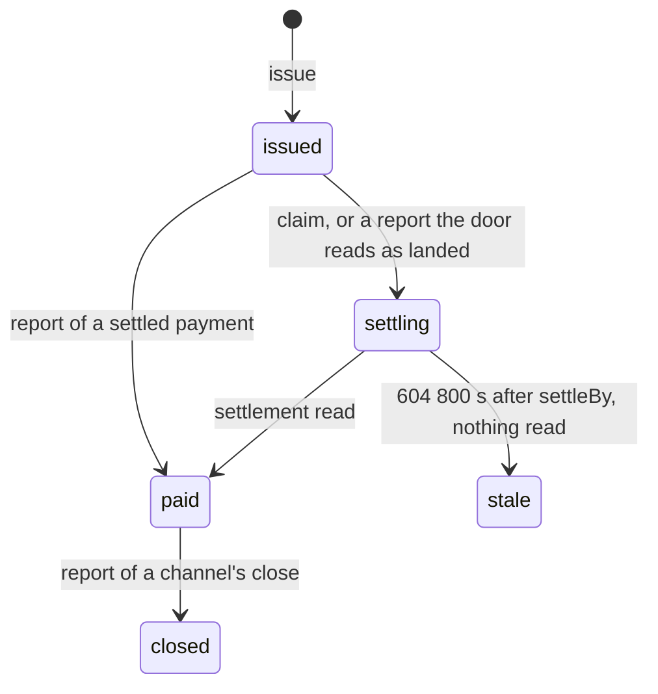

# Records and what they prove

The door keeps one **record** per ATR, keyed by its hash. The record is the payment's state: a connector keeps none of
its own and reads it with `status`.

## States

| State | Meaning |
|---|---|
| `issued` | The ATR is in the seller's storage and its hash has been placed. No payment is recorded. |
| `settling` | A payment was claimed, or reported, and its settlement is not yet read. The door finishes the record. |
| `paid` | The payment is recorded as settled. |
| `closed` | A channel pairing's close was reported and read. |
| `stale` | A payment was claimed, and 604 800 seconds after its `settleBy` no read has shown it settled or unable to settle. Terminal: the record carries a notice and is never paid after that. |

## `proves`

Every record, and every `claim` answer, states what it proves:

| Field | Meaning |
|---|---|
| `claimed` | `true` when the claim read H from the payment itself. `false` when nothing was claimed, for example on a card payment or a report without a claim. |
| `pattern` | The pairing's pattern: how it carries H, whether the buyer signs it, whether it lands on chain and whether something public carries it, and `proves`, the sentence stating what a record of this pairing shows and what it does not. `null` while nothing is recorded. |
| `settledBy` | What made the payment paid: `read` (a read of the rail), `facilitator` (the facilitator's settle answer) or `seller-report` (the seller's report, on a pairing with nothing to read). `null` while unpaid. |

Show `proves` to the buyer and the seller as the door returns it. Never claim that the buyer signed the hash where
`claimed` is `false`.

For `x402/exact/eip155/eip3009`, the sentence reads:

> The payer signed an EIP-3009 transfer authorization whose nonce is this ATR's hash. The token contract verified that
> signature when it executed the transfer, and the hash is on chain as the nonce topic of its AuthorizationUsed event
> in the settlement transaction. This does not show that amount, payee, asset or timing match the ATR's content.

Every pairing's sentence is in [the pairings reference](../reference/pairings.md).

## The agreement leg

Where a pairing's payment carries no public proof of H, a seller can require the **agreement step**: before the full
payment, the buyer's agent pays a nominal amount in a payment whose signed payload carries H. The record's
`agreement` is then `{state, network, transaction}`:

- `required`: the buyer has not paid the agreement URL yet;
- `settling`: the agreement payment is settling;
- `recorded`: the agreement payment is on chain, in `transaction` on `network`;
- `stale`: the agreement payment was claimed, and 604 800 seconds after its `settleBy` no read has shown it settled or
  unable to settle. Terminal: the record carries a notice and the agreement is never recorded after that.

`agreement` is `null` when the record needs no agreement step. See [the agreement step](../guides/agreement-step.md).

## The channel leg

For a channel, session or subscription pairing, one ATR covers the whole channel. The record's `channel` is
`{network, channel, until, closed}`, where `until` is the rail's deadline for the channel, or `null` when the rail
gives none. See [channels, sessions and subscriptions](../guides/channels.md).

## Declined, not refused

A **pushed** payment is one the buyer broadcast before the claim. If its check fails, the money has already moved, so
the door answers `200` with `state: "declined"`, the check's `code`, the hash the payment is bound to (or `null`) and
the landed `transaction`, and the record carries a declined notice with the same facts. The door never refuses a
payment that has moved; what happens to the money is between the parties.
