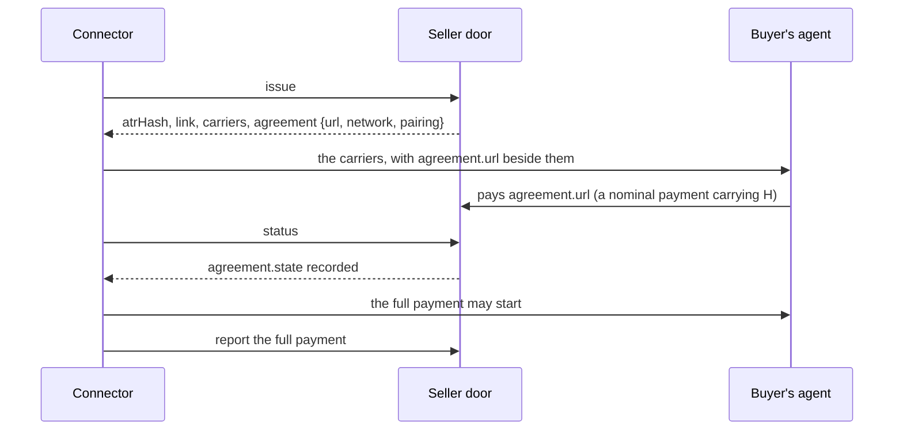

# The agreement step

Some pairings' payments carry no public proof of H: on a card payment, nothing the buyer signs carries it. For such a
pairing a seller can configure the **agreement step**: before the full payment, the buyer's agent pays a nominal
amount in a payment whose signed payload carries H. That agreement payment is the public proof, and it is on record
before the payment it covers.

The pairings whose `publicProof` is "no" are marked in [the pairings reference](../reference/pairings.md).

## How it runs



1. `issue` answers with `agreement: {url, network, pairing}`. The URL is on the tenant's host, at
   `/agreement/<atrHash>`.
2. Place `agreement.url` where the buyer's agent can see it, beside the carriers:
   - on MPP, as `opaque.legalContextAgreementUrl`;
   - elsewhere, as `legalContextAgreementUrl` beside `legalContextUrl`, or the protocol's own place beside the link.
3. The buyer's agent pays the nominal amount at `agreement.url`, on `agreement.network`, with the agreement's
   `pairing`, in a payment whose signed payload carries H.
4. Read `status` until `agreement.state` is `recorded`. Until then, `claim` answers `409 claim/agreement-first`.
5. Take the full payment, and claim or report it as its pairing needs.

Never start or accept the full payment before the agreement is recorded.

## What the record states

Once the agreement is recorded, the record's `proves.pattern.proves` names it: its network and its transaction take
the places of `<network>` and `<transaction>` in the pairing's sentence. The sentences are in
[the pairings reference](../reference/pairings.md#what-each-record-proves).

## A payment before the agreement

A payment reported before the agreement is recorded has moved, so it is recorded. Its record states what is missing
(vector `CV10`):

```ts title="before-agreement.ts"
import type { RecordView } from "@integraledger/agentic-connectors";
import { VECTORS } from "@integraledger/agentic-connectors";

const door = process.env.SELLER_DOOR_URL ?? "https://seller.example/door";
const credential = process.env.SELLER_CREDENTIAL ?? "";
const headers = { authorization: `Bearer ${credential}`, "content-type": "application/json" };

const [issue, report] = VECTORS["CV10"]!.steps;
await fetch(`${door}/issue`, { method: "POST", headers, body: JSON.stringify(issue!.request.body) });
const res = await fetch(`${door}/report`, { method: "POST", headers, body: JSON.stringify(report!.request.body) });
const record = (await res.json()) as RecordView;
console.log(res.status, record.state, record.agreement?.state, record.proves.settledBy);
console.log(record.proves.pattern?.proves);
```

```text output
200 paid required seller-report
No agreement was recorded before this payment; nothing public carries this ATR's hash.
```
