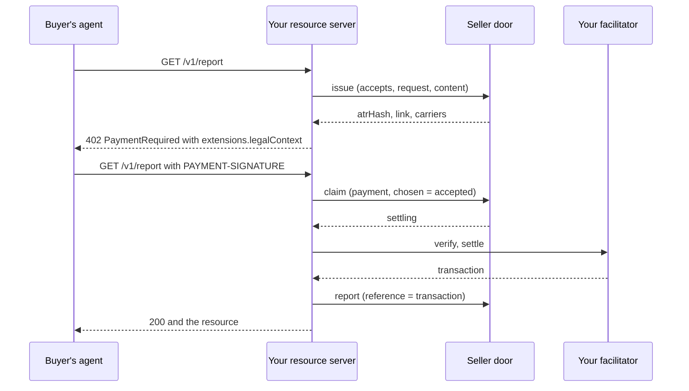

# x402 beside a seller's stack

This guide serves an x402 resource from your own server, with your own facilitator, and uses the seller door for the
ATR and the check. The pairing is `x402/exact/eip155/eip3009`: H is the `nonce` of the EIP-3009 authorization the
payer signs.



## What each call sends

| Call | Field | Value |
|---|---|---|
| `issue` | `offers` | Each `PaymentRequirements` exactly as the 402 will carry it, with `pairing` `x402/exact/eip155/eip3009`. |
| | `request` | The commitment to the request the 402 answers. |
| | `lifetimeSeconds` | The largest `maxTimeoutSeconds`. |
| `claim` | `payment` | The `PaymentPayload`, exactly as received. |
| | `chosen` | Its `accepted`. |
| | `network` | `accepted.network`. |
| | `request` | The same commitment. |
| | `settleBy` | The authorization's `validBefore`. |
| `report` | `reference` | The facilitator's `transaction`. |
| | `chosen` | `accepted`, when the payment was not claimed. |

## The whole flow

This program issues the ATR, builds the 402 with the LCP package's x402 entry point, and claims the payment the buyer
presents. The door is the stand-in (see [Getting started](../getting-started.md)), so the buyer's payment is vector
`CV6`'s. Your facilitator would verify and settle between the claim and the report.

```ts title="x402.ts"
import type { ClaimResponse, IssueRequest, IssueResponse, Refusal } from "@integraledger/agentic-connectors";
import { VECTORS } from "@integraledger/agentic-connectors";
import { isRefusal } from "@integraledger/lcp";
import { exactEip3009, type PaymentRequired, type PaymentRequirements } from "@integraledger/lcp/x402";

const door = process.env.SELLER_DOOR_URL ?? "https://seller.example/door";
const credential = process.env.SELLER_CREDENTIAL ?? "";

async function call<T>(path: string, body: unknown): Promise<T> {
  const res = await fetch(`${door}${path}`, {
    method: "POST",
    headers: { authorization: `Bearer ${credential}`, "content-type": "application/json" },
    body: JSON.stringify(body),
  });
  const answer = (await res.json()) as T | Refusal;
  if (!res.ok) throw new Error(`${path}: ${res.status} ${(answer as Refusal).code}`);
  return answer as T;
}

const option: PaymentRequirements = {
  scheme: "exact",
  network: "eip155:84532",
  amount: "10000",
  asset: "0x036CbD53842c5426634e7929541eC2318f3dCF7e",
  payTo: "0x209693Bc6afc0C5328bA36FaF03C514EF312287C",
  maxTimeoutSeconds: 60,
  extra: { name: "USDC", version: "2" },
};
const request = {
  method: "GET",
  path: "/v1/report",
  query: "",
  bodyDigest: "0xe3b0c44298fc1c149afbf4c8996fb92427ae41e4649b934ca495991b7852b855",
} as const;

// 1. Issue the ATR before the 402 goes out.
const issueBody: IssueRequest = {
  mintRequestId: "chk_7Q2:v1",
  resource: "quote",
  lifetimeSeconds: option.maxTimeoutSeconds,
  offers: [{ pairing: "x402/exact/eip155/eip3009", option }],
  request,
  content: [{ slot: "terms", bytes: Buffer.from('"Pay 10000 base units of USDC for one report."').toString("base64") }],
};
const issued = await call<IssueResponse>("/issue", issueBody);

// 2. Place H and the link in the 402, through the LCP package's entry point for the pairing.
const challenge: PaymentRequired = {
  x402Version: 2,
  resource: { url: "https://api.seller.example/v1/report" },
  accepts: [option],
};
const advertised = exactEip3009.advertise(challenge, issued.atrHash, issued.link, option);
if (isRefusal(advertised)) throw new Error(advertised.code);
const info = advertised.extensions?.["legalContext"]?.info;
console.log("402 carries H:", JSON.stringify(info) === JSON.stringify(issued.carriers.legalContext));

// 3. The buyer pays. Claim the payment before the facilitator sees it.
const payment = (VECTORS["CV6"]!.steps[1]!.request.body as { payment: { accepted: PaymentRequirements } }).payment;
const validBefore = (payment as unknown as { payload: { authorization: { validBefore: string } } }).payload.authorization.validBefore;
const claimed = await call<ClaimResponse>("/claim", {
  resource: "quote",
  pairing: "x402/exact/eip155/eip3009",
  payment,
  chosen: payment.accepted,
  network: payment.accepted.network,
  request,
  settleBy: Number(validBefore),
});
console.log("claim:", claimed.state, "claimed:", claimed.proves.claimed);

// 4. Verify and settle with your facilitator, then report its `transaction` to the door.
```

```text output
402 carries H: true
claim: settling claimed: true
```

After your facilitator settles, report `{atrHash, pairing, outcome: "paid", reference: <transaction>, network}` (see
[the `report` operation](./report.md)).

## Serving the paid call

The buyer's paid call repeats the request the 402 answered, with the payment. The request commitment covers its
method, path, query and body, not its headers. A resource server that prices variants on request headers serves the
variant that the agreement named by the ATR hash describes. Every paid call carries that ATR hash, in the payment, and
`claim` answers with it as `atrHash`.

## Where H is on chain

The facilitator submits the payer's authorization to the token contract, which verifies the signature when it
executes the transfer. H is then on chain as the `nonce` topic of the contract's `AuthorizationUsed` event in the
settlement transaction. Anyone holding the ATR can hash it and find that event; the chain alone does not reveal the
ATR's content.

## Other x402 pairings

Every x402 pairing uses the same calls; what differs is where H rides and what the record proves. The
[pairings reference](../reference/pairings.md) lists them, and the LCP package's documentation at
[lcp.integraledger.com](https://lcp.integraledger.com) describes each binding. For Tron and Polkadot, the
[profile facilitator](./facilitator.md) is a facilitator you can run.
