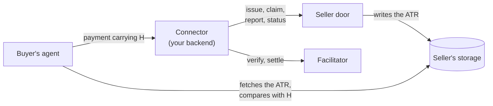

# Integra agentic connectors

This repository holds what a seller's own systems need to put proof of agreement into their payments.

The proof works like this. Before a buyer's agent pays, the seller's side assembles an **Agentic Transaction Record
(ATR)**: the agreement's record, a JSON document the seller serves. Its **ATR hash (H)** is SHA-256 over the ATR's
exact bytes. H rides inside the payment, in the field the payment protocol provides, so paying is agreeing to that
exact record. That is the pattern of the **Legal Context Protocol (LCP)**.

Two packages live here:

| Package | What it is |
|---|---|
| [`@integraledger/agentic-connectors`](../contract/README.md) | The seller door's contract: an OpenAPI 3.1 document, its TypeScript types, its refusal table and its vectors. A connector (a commerce platform plugin, or a seller's own payment stack) speaks it to issue an ATR, claim a presented payment, report a settlement and read a record's status. |
| [`@integraledger/profile-facilitator`](../profile-facilitator/README.md) | An x402 facilitator for two LCP profiles, `x402/exact/tron/lcp-trc20-memo` and `x402/exact/polkadot/lcp-assets-remark`. It verifies and settles payments whose signed transaction carries H. |

## Where to start

- **You build a connector** for a commerce platform, or you connect your own checkout: read the
  [concepts](./concepts/proof-of-agreement.md), then [Getting started](./getting-started.md), then
  [the connector rules](./guides/connector-rules.md).
- **You serve an x402 resource beside your own stack:** read [x402 beside a seller's stack](./guides/x402.md).
- **You accept x402 payments on Tron or Polkadot:** read [Run the profile facilitator](./guides/facilitator.md).
- **You implement the seller door, or a test double of it:** read [the vectors guide](./guides/vectors.md) and the
  [seller door API](./reference/seller-door-api.md).

## What these packages do not do

They carry no business or legal logic. The door checks one thing: that a payment is bound to this transaction's ATR.
It never checks amount, payee, asset, timing or payer. A discrepancy between the payment and the ATR's content is
between the parties, and the ATR records what they agreed. The facilitator checks the payment against the x402
requirements it is given and submits exactly what the payer signed; it holds no key and pays no fee.

## Related repositories

- [integra-protocol](https://github.com/IntegraLedger/integra-protocol): `@integraledger/lcp`, which assembles and
  hashes the ATR and binds H into x402, MPP, AP2, ACP, UCP, ACK and card payments. Documentation at
  [lcp.integraledger.com](https://lcp.integraledger.com).
- [integra-agentic-terms](https://github.com/IntegraLedger/integra-agentic-terms): the buyer's side, which compares
  the served ATR with H before anything is signed. Documentation at
  [agenticterms.integraledger.com](https://agenticterms.integraledger.com).
