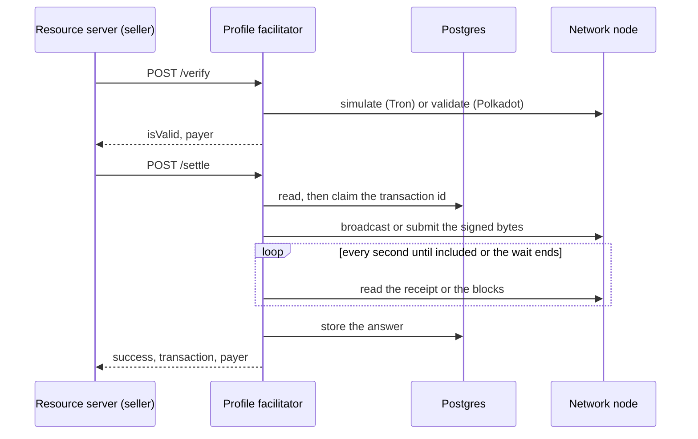

# @integraledger/profile-facilitator

An x402 facilitator for two LCP profiles: `x402/exact/tron/lcp-trc20-memo` and
`x402/exact/polkadot/lcp-assets-remark`. It verifies and settles payments whose payer-signed transaction carries the
ATR hash, and it holds no key and pays no fee.

**Documentation:** [connectors.integraledger.com/guides/facilitator](https://connectors.integraledger.com/guides/facilitator)

## What it is

In x402, a **facilitator** is the role that verifies a payment and settles it on its network, answering the x402
facilitator API: `GET /supported`, `POST /verify` and `POST /settle`. x402 specifies neither Tron nor Polkadot. The
Legal Context Protocol (LCP) defines one transfer method on each, in which the payer's own signed transaction carries
the **ATR hash (H)**: SHA-256 over the exact bytes of the Agentic Transaction Record (ATR), the agreement's record.
Paying is then agreeing to that exact record, and the proof is on chain.

| Profile | `network` | `extra.assetTransferMethod` | Where H rides |
|---|---|---|---|
| `x402/exact/tron/lcp-trc20-memo` | `tron:<chain id in decimal>` | `lcp-trc20-memo` | The transaction's `raw_data.data`: the 77 ASCII bytes `lcp:sha256:` followed by H, beside one TRC-20 `transfer(payTo, amount)`. |
| `x402/exact/polkadot/lcp-assets-remark` | `polkadot:68d56f15f85d3136970ec16946040bc1` (Polkadot Asset Hub) or `polkadot:67f9723393ef76214df0118c34bbbd3d` (Westend Asset Hub) | `lcp-assets-remark` | `system.remark_with_event(R)`, where R is exactly `lcp:sha256:` followed by H in lowercase hex, batched with `assets.transfer_keep_alive` in one `utility.batch_all`. |

This package implements each profile's rule 5, the facilitator's duties. The profiles themselves are published with
`@integraledger/lcp`, in [integra-protocol](https://github.com/IntegraLedger/integra-protocol).

The facilitator is a pass-through. It checks the payment against the requirements it is given, asks a node to
validate or simulate it, submits exactly the bytes the payer signed, deduplicates, and reports what the network shows.

## Key concepts

- **Agentic Transaction Record (ATR):** the agreement's record, a JSON document the seller serves.
- **ATR hash (H):** SHA-256 over the ATR's exact bytes.
- **Legal Context Protocol (LCP):** the pattern these profiles implement: the payment carries H, so paying is agreeing
  to that exact record.
- **Pairing:** a payment protocol, scheme and rail combination. This facilitator serves two:
  `x402/exact/tron/lcp-trc20-memo` and `x402/exact/polkadot/lcp-assets-remark`.
- **Binding:** how H rides in a pairing's payment: here, the Tron memo and the Polkadot remark.
- **Seller:** the party serving the resource. It calls this facilitator from its x402 resource server.
- **Facilitator:** the x402 role that verifies and settles.
- **Deduplication:** each payment is settled at most once, keyed by its network and transaction id, in Postgres.



## Install

```sh
npm install @integraledger/profile-facilitator
```

It needs Node.js `>=26.10.0`, Postgres (the tests run on Postgres 18), and an HTTP endpoint for each network you
serve: a Tron FullNode and Solidity node, or a Polkadot Asset Hub RPC node. It is ESM only.

## Quickstart

Start the facilitator for Tron mainnet and read what it supports. The node URLs below are java-tron's default HTTP
ports on your own node; the facilitator calls them only when a payment arrives. `DATABASE_URL` is your Postgres
connection string.

```ts title="supported.ts"
import { serveProfileFacilitator } from "@integraledger/profile-facilitator";

const facilitator = await serveProfileFacilitator({
  listen: "127.0.0.1:4020",
  tron: [{ network: "tron:728126428", fullNode: "http://127.0.0.1:8090", solidityNode: "http://127.0.0.1:8091" }],
  polkadot: [{ network: "polkadot:68d56f15f85d3136970ec16946040bc1", rpc: "http://127.0.0.1:9944" }],
  store: { url: process.env.DATABASE_URL ?? "postgres://postgres@127.0.0.1:5432/postgres" },
  settleWaitMs: 30_000,
});

const supported = await (await fetch("http://127.0.0.1:4020/supported")).json();
console.log(JSON.stringify(supported, null, 2));
await facilitator.close();
```

```text output
{
  "kinds": [
    {
      "x402Version": 2,
      "scheme": "exact",
      "network": "tron:728126428",
      "extra": {
        "assetTransferMethod": "lcp-trc20-memo"
      }
    },
    {
      "x402Version": 2,
      "scheme": "exact",
      "network": "polkadot:68d56f15f85d3136970ec16946040bc1",
      "extra": {
        "assetTransferMethod": "lcp-assets-remark"
      }
    }
  ],
  "extensions": [],
  "signers": {}
}
```

## Run it

The package exports one function that starts the server; it has no command-line entry. A service is a short module
that reads its configuration and stops cleanly on a signal:

```ts title="facilitator.ts" server
import { serveProfileFacilitator } from "@integraledger/profile-facilitator";

const listen = process.env.LISTEN ?? "127.0.0.1:4021";
const facilitator = await serveProfileFacilitator({
  listen,
  tron: [
    {
      network: "tron:728126428",
      fullNode: process.env.TRON_FULL_NODE ?? "http://127.0.0.1:8090",
      solidityNode: process.env.TRON_SOLIDITY_NODE ?? "http://127.0.0.1:8091",
    },
  ],
  store: { url: process.env.DATABASE_URL ?? "postgres://postgres@127.0.0.1:5432/postgres" },
  settleWaitMs: Number(process.env.SETTLE_WAIT_MS ?? 30_000),
});
for (const signal of ["SIGINT", "SIGTERM"] as const) {
  process.once(signal, () => {
    void facilitator.close().then(() => process.exit(0));
  });
}
console.log(`facilitator listening on ${listen}`);
```

```text output
facilitator listening on 127.0.0.1:4021
```

Run it with `node facilitator.ts`: Node.js 26 runs TypeScript directly. `close()` stops accepting requests, closes
open connections, disconnects from the Polkadot nodes and closes the Postgres pool.

### Configuration

`serveProfileFacilitator(config)` takes a `ProfileFacilitatorConfig`:

| Field | Type | Meaning |
|---|---|---|
| `listen` | `string` | `"host:port"`; an IPv6 host may be written in brackets. |
| `tron` | `{ network, fullNode, solidityNode }[]`, optional | One entry per Tron network. `network` is `tron:<chain id in decimal>`. `fullNode` serves `/wallet/…` and `solidityNode` serves `/walletsolidity/…`; give each its base URL. |
| `polkadot` | `{ network, rpc }[]`, optional | One entry per network, `polkadot:68d56f15f85d3136970ec16946040bc1` or `polkadot:67f9723393ef76214df0118c34bbbd3d`. `rpc` is an HTTP JSON-RPC endpoint that serves `state_call` and `author_submitExtrinsic`. |
| `store` | `{ url }` | The Postgres connection string. Postgres holds the deduplication table only. |
| `settleWaitMs` | `number` | How long `/settle` waits for inclusion before it answers `settlement_pending`. A value that is not a positive finite number means 30 000. |

The facilitator serves only the networks it is configured with. A request for any other network is answered
`invalid_network`. At start it creates its table if it does not exist; a Polkadot node's runtime metadata is loaded on
the first payment for that network, and loaded again whenever the node's runtime version changes.

## Verify and settle

Both `POST /verify` and `POST /settle` take the x402 facilitator request:
`{x402Version: 2, paymentPayload, paymentRequirements}`, with `paymentPayload.x402Version` 2 and
`paymentRequirements.scheme` `"exact"`.

```ts title="verify.ts"
import { serveProfileFacilitator } from "@integraledger/profile-facilitator";

const facilitator = await serveProfileFacilitator({
  listen: "127.0.0.1:4022",
  tron: [{ network: "tron:728126428", fullNode: "http://127.0.0.1:8090", solidityNode: "http://127.0.0.1:8091" }],
  store: { url: process.env.DATABASE_URL ?? "postgres://postgres@127.0.0.1:5432/postgres" },
  settleWaitMs: 30_000,
});

const request = {
  x402Version: 2,
  paymentPayload: { x402Version: 2, payload: { transaction: "0a02" } },
  paymentRequirements: {
    scheme: "exact",
    network: "tron:3448148188",
    amount: "10000",
    asset: "TR7NHqjeKQxGTCi8q8ZY4pL8otSzgjLj6t",
    payTo: "TCwX1UeSkVfu43HD5xNMmFqDR2Xgjdxihx",
    maxTimeoutSeconds: 60,
    extra: { assetTransferMethod: "lcp-trc20-memo" },
  },
};
for (const path of ["/verify", "/settle"]) {
  const res = await fetch(`http://127.0.0.1:4022${path}`, {
    method: "POST",
    headers: { "content-type": "application/json" },
    body: JSON.stringify(request),
  });
  console.log(path, res.status, JSON.stringify(await res.json()));
}
await facilitator.close();
```

```text output
/verify 200 {"isValid":false,"invalidReason":"invalid_network"}
/settle 200 {"success":false,"errorReason":"invalid_network","transaction":"","network":"tron:3448148188"}
```

### What `/verify` checks on Tron

In order; the first failure is the answer.

1. The network is configured, and the requirements are ones the profile admits (its rule 1), else
   `invalid_network` or `invalid_payment_requirements`.
2. `payload.transaction` is a serialized Tron `Transaction` in hex that decodes to exactly one
   `TriggerSmartContract` whose `data` is an LCP `sha256` string, else `invalid_payload`.
3. `asset` and `payTo` are Tron addresses, else `invalid_payment_requirements`.
4. The contract called is `asset`, and the call data is exactly `transfer(payTo, amount)`, else `invalid_payload`.
5. The transaction carries exactly one signature, else `unsupported_permission`. That signature recovers to the
   transaction's owner, else `invalid_payload`. A multi-signature owner permission is not served.
6. `expiration` is in the future and no later than now plus `maxTimeoutSeconds`, else `invalid_payload`.
7. The FullNode's `/wallet/triggerconstantcontract` simulates the transfer without failure, else
   `invalid_transaction`. A node that does not answer gives `unexpected_verify_error`.

The answer is `{isValid: true, payer}`, with `payer` the owner in base58check.

### What `/settle` does on Tron

1. Repeats every check of `/verify`.
2. Reads the stored answer for the transaction id. A final one is returned as it is, so a repeated `/settle` gets the
   first answer.
3. Claims the transaction id with one conditional insert, so concurrent settles of one payment broadcast once.
4. Broadcasts the signed bytes with `/wallet/broadcasthex`. A `DUP_TRANSACTION_ERROR` counts as broadcast.
5. Reads the receipt with `gettransactioninfobyid` every second. `SUCCESS` at the FullNode is success. Any other
   result is a failure only once the Solidity node, which serves solidified blocks alone, shows it. A transaction
   whose expiration has passed and that no node shows once the solidified head is two slots past it can never be
   included, and is answered `invalid_transaction_state`.
6. Stores the answer and returns it.

Success is `{success: true, transaction, network, payer}`, where `transaction` is the transaction id in hex.

### What `/verify` checks on Polkadot

1. The network is configured, and the requirements are ones the profile admits, else `invalid_network` or
   `invalid_payment_requirements`.
2. `payload.extrinsic` and `payload.call` are lowercase hex; the call is exactly
   `utility.batch_all([assets.transfer_keep_alive(asset, Id(payTo), amount), system.remark_with_event(R)])` for this
   `asset`, `payTo` and `amount`, and R is exactly the 77 bytes `lcp:sha256:` followed by H in lowercase hex, else
   `invalid_payload`. `System.Remarked` carries the BLAKE2b-256 of the remark's bytes as signed, so a remark that
   spells H any other way, such as with upper-case digits, is refused.
3. With the network's runtime metadata, the extrinsic decodes as a signed v4 extrinsic whose call is `payload.call`
   byte for byte, with a mortal era, else `invalid_payload`. The node must serve the chain the network names (its
   genesis hash), else `unexpected_verify_error`.
4. `TaggedTransactionQueue_validate_transaction` at the best block returns `Ok`, else `invalid_transaction`.

The answer is `{isValid: true, payer}`, with `payer` the signer in SS58.

### What `/settle` does on Polkadot

1. Repeats every check of `/verify`.
2. Reads the stored answer for the extrinsic's BLAKE2b-256 hash, and returns a final one as it is.
3. Claims the hash, with the first block to scan: the block after the finalized head read before validation, never
   before the era's birth.
4. Submits with `author_submitExtrinsic`. A refusal that says the node has already seen the extrinsic or its nonce is
   read as possibly included, and the scan runs.
5. Scans every second: first the finalized blocks, then the blocks up to the head. In the block that holds the
   extrinsic, success needs `System.ExtrinsicSuccess`, `System.Remarked` for R's BLAKE2b-256 and `Assets.Transferred`
   for `asset`. A failure counts only in a finalized block. Once every block to the era's last is finalized without
   the extrinsic, it can never be included: `invalid_transaction_state`.
6. Stores the answer and returns it.

Success is `{success: true, transaction, network, payer}`, where `transaction` is `<block hash>-<extrinsic index>`.
While the extrinsic is broadcast but not yet in a block, the answer is `settlement_pending` with `transaction` set to
the extrinsic's hash.

### Pending and repeated settles

When the wait ends first, `/settle` answers `{success: false, errorReason: "settlement_pending", transaction}` with
the transaction id or extrinsic hash; x402 requires that `transaction` not be empty. Call `/settle` again with the
same request: it reads the chain from where it stopped, never submits twice, and returns the final answer once there
is one. An answer with an empty `transaction` means nothing was submitted. When the store cannot be read, the
facilitator cannot know whether the payment was submitted, so it answers `settlement_pending` with the id.

## API reference

The package's entry point exports:

| Export | Kind | What it is |
|---|---|---|
| `serveProfileFacilitator(config)` | `(c: ProfileFacilitatorConfig) => Promise<{ close(): Promise<void> }>` | Opens the store, starts the HTTP server and resolves once it listens. |
| `ProfileFacilitatorConfig` | interface | The configuration above. |
| `VerifyAnswer` | type | `{isValid: true, payer}` or `{isValid: false, invalidReason, payer?}`. |
| `SettleAnswer` | type | `{success: true, transaction, network, payer}` or `{success: false, errorReason, transaction, network}`. |

### HTTP API

| Request | Answer |
|---|---|
| `GET /supported` | `200` `{kinds, extensions: [], signers: {}}`, one kind per configured network. |
| `POST /verify` | `200` with a `VerifyAnswer`; `400` `{isValid: false, invalidReason: "invalid_payload"}` when the body is not JSON. |
| `POST /settle` | `200` with a `SettleAnswer`; `400` with `errorReason` `invalid_payload` when the body is not JSON. |
| A body over 64 KiB | `413`, and the connection is closed. |
| Another method on a served path | `405` `{error}`. |
| Any other path | `404` `{error}`. |

The facilitator has no authentication of its own. Serve it on a private interface, or behind your own network
controls, to the resource servers that use it.

### Reasons

| Reason | `/verify` | `/settle` | Meaning |
|---|---|---|---|
| `invalid_x402_version` | yes | yes | `x402Version` is not 2 in the request or the payload. |
| `unsupported_scheme` | yes | yes | `scheme` is not `"exact"`. |
| `invalid_network` | yes | yes | The network is not one this facilitator is configured with. |
| `invalid_payment_requirements` | yes | yes | The requirements are not ones the profile admits. |
| `invalid_payload` | yes | yes | The payload does not match the profile or the requirements, or its signature or expiration fails. |
| `unsupported_permission` | yes | yes | Tron: the transaction carries more than one signature. |
| `invalid_transaction` | yes | yes | The node refuses the transaction in simulation or validation. |
| `unexpected_verify_error` | yes | no | The node could not be read. |
| `unexpected_settle_error` | no | yes | The node could not be read before submission, or refused the submission. |
| `settlement_pending` | no | yes | Submitted, and not yet final when the wait ended. |
| `invalid_transaction_state` | no | yes | Included and failed, or it can never be included. |

`unsupported_permission` and `invalid_transaction` are this facilitator's, for a multi-signature Tron owner and for
a transaction the node refuses in simulation or validation. The others are the x402 specification's.

### Storage

Postgres holds one table, created at start:

```sql
CREATE TABLE IF NOT EXISTS settlement (
  network text NOT NULL,
  id text NOT NULL,
  answer jsonb,
  until timestamptz NOT NULL,
  since bigint,
  PRIMARY KEY (network, id)
)
```

- One row per settled payment, keyed by network and transaction id (Tron) or extrinsic hash (Polkadot).
- `answer` is null while the row is claimed and the answer is not yet written. A final answer is never replaced; a
  pending one is replaced by what a later read of the chain shows.
- `until` is the end of the payment's validity window: Tron's `expiration`, or the end of the Polkadot era. A row is
  kept for 24 hours after it, so a repeat in that time reads the stored answer before anything is verified again. A
  sweep every minute drops older rows.
- `since` is, for Polkadot, the first block not yet shown at finality to lack the extrinsic.
- The pool holds at most 10 connections. Acquiring a connection, each query and each statement are bounded by 5
  seconds.

### Bounds and logs

- Each node call has a timeout of at most 5 seconds and an answer of at most 4 MiB.
- A request body is at most 64 KiB. The server's request timeout is `settleWaitMs` plus 60 seconds.
- The facilitator writes one JSON line on standard error for what the operator should see and the answer does not
  carry: `settlement-failed` (with the events or receipt result the chain shows), `settlement-expired` and
  `answer-not-stored`.

## Security model and guarantees

- **No key, no fee.** The facilitator signs nothing. It submits exactly the bytes the payer signed, and the payer pays
  every fee, as both profiles require.
- **Settled once.** Settlements are deduplicated by transaction id or extrinsic hash, atomically, until the validity
  window ends and for 24 hours after.
- **Success only from the chain.** `success: true` is given only when a node shows the transaction in a block with
  the profile's success conditions.
- **What it does not check.** It checks that the payment carries an LCP `sha256` string, not which H the seller
  issued. The resource server refuses a payment whose H it did not issue for that request (each profile's rule 6),
  for example through the seller door's `claim`. It checks the amount, asset and payee against the requirements it
  is given because x402 requires that of a facilitator, and carries no business or legal logic beyond that.

## Test vectors and conformance

The tests check each profile's rule 5 against local node stubs, with the transactions of `@integraledger/lcp`'s
shared vectors. The Tron stubs answer with Tron mainnet's recorded answers (`test/fixtures/tron-mainnet-answers.json`),
and the Polkadot stub with Polkadot Asset Hub's recorded runtime metadata
(`test/fixtures/polkadot-asset-hub-2005000.json.gz`). They cover two concurrent settles of one payment (one
submission, equal answers), repeated settles while the node is down, a settle that finds its id claimed and
unanswered, the end of each validity window (Tron's expiration and Polkadot's mortal era), and a Polkadot remark that
spells H with upper-case digits, refused before the node is asked. They need `INTEGRA_DATABASE_URL` set to a
Postgres database.

## Requirements

- Node.js `>=26.10.0`.
- Postgres; the tests run on Postgres 18.
- For Tron, a FullNode and a Solidity node with java-tron's HTTP API. For Polkadot, an Asset Hub RPC node that serves
  JSON-RPC over HTTP.

## Contributing

See the [repository's README](https://github.com/IntegraLedger/integra-agentic-connectors#readme) and
[CONTRIBUTING.md](https://github.com/IntegraLedger/integra-agentic-connectors/blob/main/CONTRIBUTING.md).

## License

[Apache-2.0](./LICENSE).
